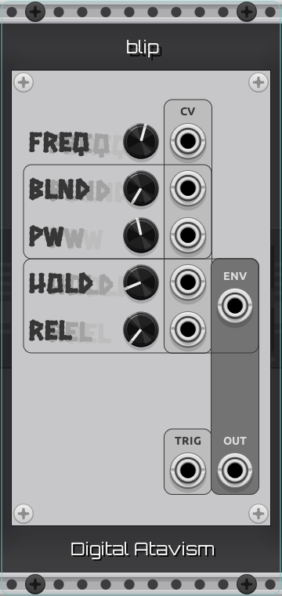

# Digital Atavism

Modules for [VCV Rack](https://vcvrack.com/) by [Shawn Laptiste](https://linktr.ee/lazerfalcon)

----
## Table of Contents:

* [coin](#coin)
* [blip](#blip)
* [hit](#hit)
* [d-trig](#d-trig)
* [ut-p](#ut-p)
* [ut-ox](#ut-ox)

----

## coin

coin is a port of the "pickup/coin" mode of DrPetter's [sfxr](https://www.drpetter.se/project_sfxr.html). It can most easily be used as a voice, an oscillator, a Hold-Release (HR) envelope, or a trigger delay.

#### Controls
  *  **FREQ** - The base frequency of the voice. 
  This CV input is 1V per octave.
  *  **FMOD** - The change in frequency.
  This CV input is 1V per octave.
  *  **TIME** - The delay before modifying the frequency.
  *  **HOLD** - The duration of the hold section of the HR envelope.
  *  **REL** - The duration of the release section of the HR envelope.
  *  **PUNCH** - The amount of drive applied during the hold section of the HR envelope.
  *  **TRIG** - The trigger CV input.
  With a wire connected to this input, the rising edge of a trigger or gate signal will activate the voice. When left unplugged, the module will act like an oscillator at the base frequency, and the **FMOD**, **TIME**, **HOLD**, **REL**, and **PUNCH** controls will have no effect.

#### Outputs
  *  **TRIG** - Outputs a trigger after the frequency modification delay time has elapsed.
  *  **ENV** - HR envelope output.
  *(Note that with positive values for **PUNCH**, this value will exceed +10V.)*
  *  **OUT** - Audio output.

----

## blip

blip is a port of the "blip/select" mode of DrPetter's [sfxr](https://www.drpetter.se/project_sfxr.html). It can most easily be used as a voice, an oscillator, or a Hold-Release (HR) envelope.

#### Controls
  *  **FREQ** - The base frequency of the voice. 
  This CV input is 1V per octave.
  *  **BLND** - The blend amount crossfades between square wave (0%) and sawtooth (100%).
  *  **PW** - Pulse-width of the square wave.
  *  **HOLD** - The duration of the hold section of the HR envelope.
  *  **REL** - The duration of the release section of the HR envelope.
  *  **TRIG** - The trigger CV input.
  With a wire connected to this input, the rising edge of a trigger or gate signal will activate the voice. When left unplugged, the module will act like an oscillator at the base frequency, and the **HOLD** and **REL** controls will have no effect.

#### Outputs
  *  **ENV** - HR envelope output.
  *  **OUT** - Audio output.

----

## hit

hit is a port of the "hit/hurt" mode of DrPetter's [sfxr](https://www.drpetter.se/project_sfxr.html). It can most easily be used as a voice, an oscillator, or a Hold-Release (HR) envelope.

#### Controls
  *  **FREQ** - The base frequency of the voice. 
  This CV input is 1V per octave.
  *  **SLIDE**
  *  **BLND** - The blend amount crossfades between square wave (0%) and sawtooth (100%).
  *  **PW** - Pulse-width of the square wave.
  *  **HOLD** - The duration of the hold section of the HR envelope.
  *  **REL** - The duration of the release section of the HR envelope.
  *  **LPF**
  *  **HPF**
  *  **TRIG** - The trigger CV input.
  With a wire connected to this input, the rising edge of a trigger or gate signal will activate the voice. When left unplugged, the module will act like an oscillator at the base frequency, and the **SLIDE**, **HOLD**, and **REL** controls will have no effect.

#### Outputs
  *  **ENV** - HR envelope output.
  *  **OUT** - Audio output.

----

## d-trig

----

## ut-p

----

## ut-ox

